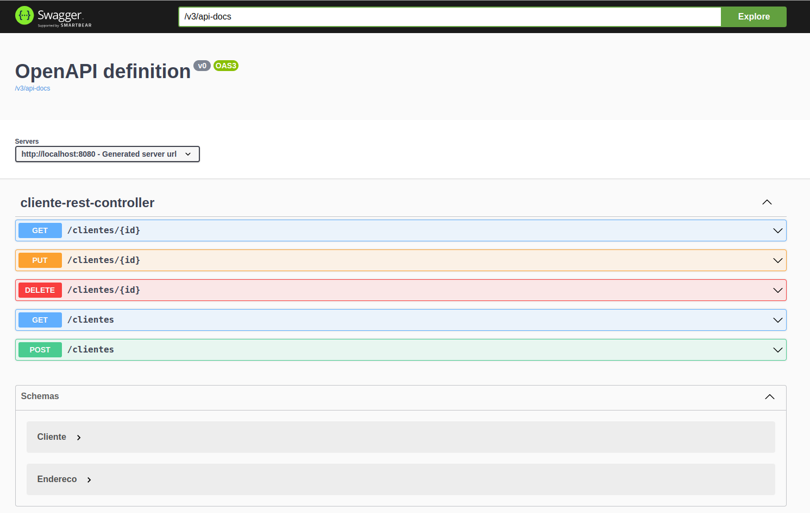

## Getting Started

Desafio de Projeto Modulo Spring-Framework - `Bootcamp` - DIO

## Explorando Padrões de Projetos na Prática com Java

Repositório com as implementações dos padrões de projeto explorados no Lab "Explorando Padrões de Projetos na Prática com Java". Especificamente, este projeto explorou alguns padrões usando o Spring Framework, são eles:

- Singleton: @Bean e @Autowired;
- Strategy/Repository: @Service e @Repository;
- Facade: construiremos uma API REST com o mesmo objetivo desse padrão, abstrair a complexidade das seguintes integrações: Spring Data JPA e ViaCEP (Feign).

## Projeto

- Acesso a API - http://localhost:8080/swagger-ui/index.html